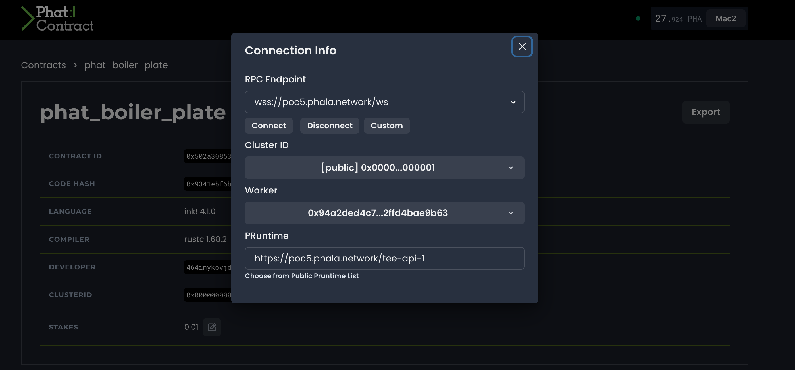
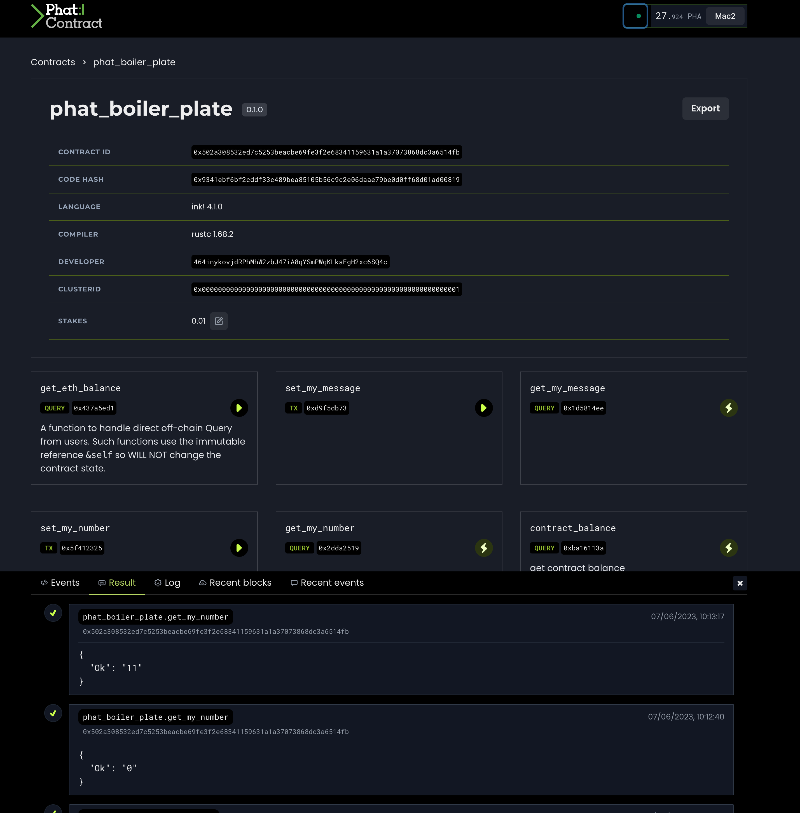

$yarn

to install, then

$npm start

We are trying to connect to a Phat contract using the new public testnet

Have reinstalled phala sdk

We have a very basic Phat contract where we can read and write a number value and a string value

The abi , libr.rs and .contract are within Abis folder

The file Setup.js has all the logic for estalishing the api, connecting to a phat contract and do a simple read and write

Using the old methododoly

        const wsProvider = new WsProvider('wss://poc5.phala.network/ws');

        const api = await ApiPromise.create({
            provider: wsProvider,
            types: { ...types, ...typeDefinitions }
        });

        await api.isReady;

        //METHOD 1 OLD METHOD WORKS
        const phatRegistry = await OnChainRegistry.create(api)
        const phat_abi = phat_boiler_plate_metadata;
        const phat_contractKey = await phatRegistry.getContractKey(phat_contractId);

        const contract = new PinkContractPromise(api, phatRegistry, phat_abi, phat_contractId, phat_contractKey);
        phat_contract_boiler_plate = contract;

The api is set up and we connect to a contract

 

Using the new guidelines form here https://www.npmjs.com/package/@phala/sdk
and writing

    const wsProvider = new WsProvider('wss://poc5.phala.network/ws');

    const api = await ApiPromise.create({
    	provider: wsProvider,
    	types: { ...types, ...typeDefinitions }
    });

    await api.isReady;

    //METHOD 2 NEW METHOD ERRORS
    const pruntimeURL = 'https://poc5.phala.network/tee-api-1/';
    // const metadata = phat_boiler_plate_metadata;
    const metadata = JSON.stringify(phat_boiler_plate_metadata);

    const contract2 = new ContractPromise(
    	await create({api, baseURL: pruntimeURL, phat_contractId}),
    	JSON.parse(metadata),
    	phat_contractId
    );

## ERRORS WHY?

Lastly in both cases it errors when trying to read or write using certificate

Using the Polakdot Extension here: const setPolkadotInjector = async (injector, injectorAddress) => {

Using a dummy account here const getAccountIdtoHex = async (accountI32="") => {}

Example:

Read function const get_my_number = async () => {

 

## ERRORS WHY?

 

> Note: In the webpage SmartPay Dashboard by clicking Read MyNum button we invoked get_my_number = async () => { READ
> and clicking Phat SetMyNum button invokes const set_my_number = async (newNumber=5) => { WRITE

 
 
 

 

 

 
 

THIS IS A BOILER PLATE FRONT END FOR PHALA DURING PHAT CLOSED BETA

HAS A BOILER PLATE LIB.RS AND .CONTRACT IN Abis FOLDER AND THE FRON END IS LINKED ON SMARTPAY DASHBOARD THE BUTTONS

READ MYNUM

PHAT SETMY NUM

# Getting Started with Create React App

This project was bootstrapped with [Create React App](https://github.com/facebook/create-react-app).

## Available Scripts

In the project directory, you can run:

### `npm start`

Runs the app in the development mode.\
Open [http://localhost:3000](http://localhost:3000) to view it in your browser.

The page will reload when you make changes.\
You may also see any lint errors in the console.

### `npm test`

Launches the test runner in the interactive watch mode.\
See the section about [running tests](https://facebook.github.io/create-react-app/docs/running-tests) for more information.

### `npm run build`

Builds the app for production to the `build` folder.\
It correctly bundles React in production mode and optimizes the build for the best performance.

The build is minified and the filenames include the hashes.\
Your app is ready to be deployed!

See the section about [deployment](https://facebook.github.io/create-react-app/docs/deployment) for more information.

### `npm run eject`

**Note: this is a one-way operation. Once you `eject`, you can't go back!**

If you aren't satisfied with the build tool and configuration choices, you can `eject` at any time. This command will remove the single build dependency from your project.

Instead, it will copy all the configuration files and the transitive dependencies (webpack, Babel, ESLint, etc) right into your project so you have full control over them. All of the commands except `eject` will still work, but they will point to the copied scripts so you can tweak them. At this point you're on your own.

You don't have to ever use `eject`. The curated feature set is suitable for small and middle deployments, and you shouldn't feel obligated to use this feature. However we understand that this tool wouldn't be useful if you couldn't customize it when you are ready for it.

## Learn More

You can learn more in the [Create React App documentation](https://facebook.github.io/create-react-app/docs/getting-started).

To learn React, check out the [React documentation](https://reactjs.org/).

### Code Splitting

This section has moved here: [https://facebook.github.io/create-react-app/docs/code-splitting](https://facebook.github.io/create-react-app/docs/code-splitting)

### Analyzing the Bundle Size

This section has moved here: [https://facebook.github.io/create-react-app/docs/analyzing-the-bundle-size](https://facebook.github.io/create-react-app/docs/analyzing-the-bundle-size)

### Making a Progressive Web App

This section has moved here: [https://facebook.github.io/create-react-app/docs/making-a-progressive-web-app](https://facebook.github.io/create-react-app/docs/making-a-progressive-web-app)

### Advanced Configuration

This section has moved here: [https://facebook.github.io/create-react-app/docs/advanced-configuration](https://facebook.github.io/create-react-app/docs/advanced-configuration)

### Deployment

This section has moved here: [https://facebook.github.io/create-react-app/docs/deployment](https://facebook.github.io/create-react-app/docs/deployment)

### `npm run build` fails to minify

This section has moved here: [https://facebook.github.io/create-react-app/docs/troubleshooting#npm-run-build-fails-to-minify](https://facebook.github.io/create-react-app/docs/troubleshooting#npm-run-build-fails-to-minify)

 
 
 
